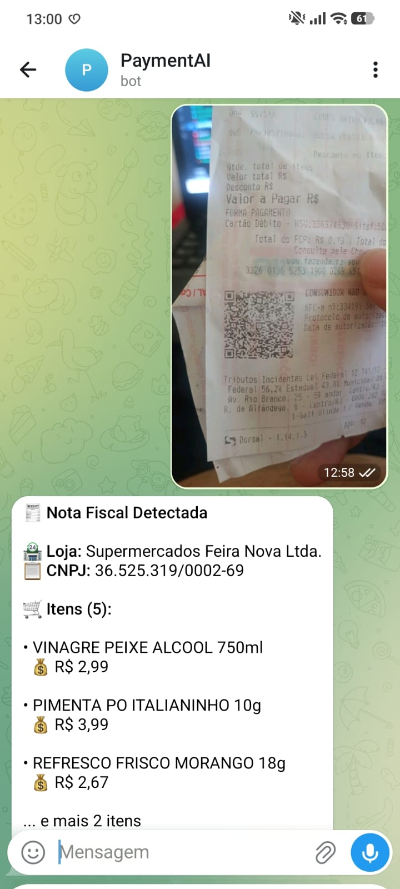
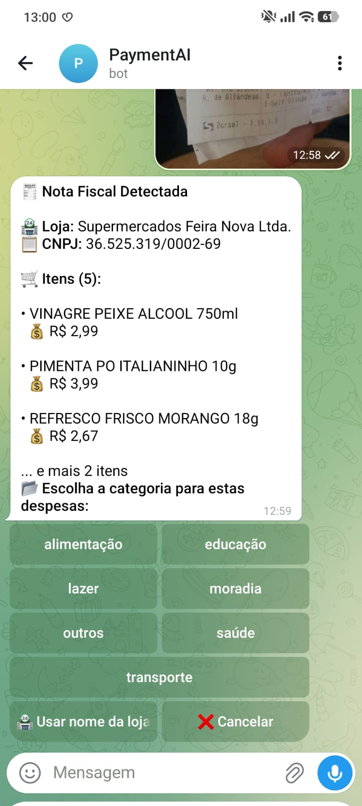

# 💰 Chatbot Financeiro Telegram

Bot para organização de finanças pessoais com leitura automática de notas fiscais via QR Code e processamento de imagens.

## 🚀 Funcionalidades

- 📸 **Leitura de Notas Fiscais**: Envie uma foto e o bot extrai automaticamente todos os itens
- 💳 **Registro de Transações**: Adicione receitas e despesas por comandos ou mensagens inteligentes
- 📊 **Relatórios**: Visualize extratos e relatórios mensais
- 🏷️ **Categorias Personalizadas**: Organize suas despesas por categorias
- 🤖 **Mensagens Inteligentes**: "Gastei 50 reais com alimentação" - o bot entende e registra!
- 📱 **Interface Amigável**: Comandos intuitivos e botões interativos

## 🛠️ Tecnologias Utilizadas


### Bibliotecas Principais

- **python-telegram-bot** (≥22.6) - Interface com a API do Telegram
- **SQLAlchemy** (2.0.46) - ORM para banco de dados
- **Selenium** (4.40.0) - Web scraping para notas fiscais
- **pyzbar** (0.1.9) - Leitura de QR Codes
- **Pillow** (≥10.0.0) - Processamento de imagens
- **BeautifulSoup4** (0.0.2) - Parsing HTML
- **pandas** (3.0.0) - Manipulação de dados

## 🐳 Execução com Docker

### Pré-requisitos
- Docker e Docker Compose instalados
- Token do Telegram Bot

### 1. Configurar Variáveis de Ambiente

Crie o arquivo `.env`:
```env
# Telegram Bot Token
BOT_TOKEN=seu_bot_token_aqui

# Selenium Remote URL
SELENIUM_REMOTE_URL=http://selenium:4444
```

### 2. Iniciar os Containers

```bash
# Construir e iniciar os containers
docker-compose up --build -d

# Verificar status
docker ps
```

### 3. Verificar Funcionamento

```bash
# Verificar logs do bot
docker logs bot

# Testar conexão Selenium
docker exec bot python -c "from src.read_qrcode import ReadQrcode; print('✅ Importação OK')"
```

## 📱 Comandos do Bot

| Comando | Descrição |
|---------|-----------|
| `/start` | Inicia o bot e configura categorias padrão |
| `/saldo` | Verifica saldo atual |
| `/extrato` | Exibe extrato do mês corrente |
| `/relatorio` | Gera relatório mensal |
| `/categorias` | Lista categorias disponíveis |
| `/metas` | Gerencia metas financeiras |
| `/ajuda` | Exibe menu de ajuda |

## 📸 Screenshots

### Mensagens Inteligentes


O bot reconhece linguagem natural para registrar transações:
- "Gastei 50 reais com alimentação"
- "Recebi 1000 de salário" 
- "Comprei material por 150 reais"

### Leitura de QR Code



Processo automático de extração de dados da nota fiscal:
1. 📸 Envie uma foto da nota fiscal
2. 🧾 O bot lê o QR Code automaticamente
3. 📋 Exibe todos os itens encontrados

### Seleção de Categoria



Interface intuitiva para organização:
- 🏷️ Categorias personalizadas disponíveis
- 🏪 Opção de usar nome da loja
- 📱 Botões interativos fáceis de usar

### Confirmação de Registro


Tela de confirmação com detalhes completos:
- 📊 Resumo das transações
- 💰 Valor total calculado
- ✅ Confirmação segura antes de salvar

### Demonstração Completa


Fluxo completo de uso:
1. 📸 Envie uma foto da nota fiscal
2. 🧾 O bot lê o QR Code automaticamente
3. 📋 Exibe todos os itens encontrados
4. 🏷️ Permite selecionar a categoria
5. ✅ Confirma o registro das despesas

## 🧾 Processamento de Notas Fiscais

1. Envie uma foto da nota fiscal
2. O bot lê o QR Code automaticamente
3. Extrai todos os itens da nota
4. Permite escolher a categoria
5. Confirma o registro das despesas

## 📁 Estrutura do Projeto

```
src/
├── bot.py                 # Arquivo principal do bot
├── photo_handler.py       # Processamento de imagens
├── read_qrcode.py         # Leitura de QR Codes com Selenium
├── command_menu/          # Comandos do bot
│   ├── start_command.py
│   ├── add_command.py
│   ├── balance_command.py
│   └── ...
└── tools/
    └── database.py        # Configuração do banco de dados
```

## 🔧 Desenvolvimento Local

```bash
# Criar ambiente virtual
python -m venv .venv
source .venv/bin/activate  # Linux/Mac
.venv\Scripts\activate     # Windows

# Instalar dependências
pip install -r requirements.txt

# Configurar .env e executar
python src/bot.py
```

## 📝 Licença

Este projeto está sob licença MIT.
